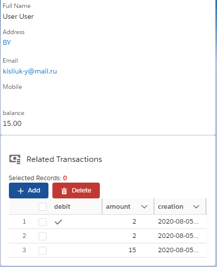

# PocketMoneyApp
User recource tracking app.

Written using Lightning Web Components. Allow crud operations with transactions.

Objects:
 - User(Standard): added field balance for tracking user balance;
 - Transaction(Custom): { fields: debit(Boolean) - is it debit(-)/credit(+); amount(Decimal); created(DateTime) - date and time of creation }.

#Look

